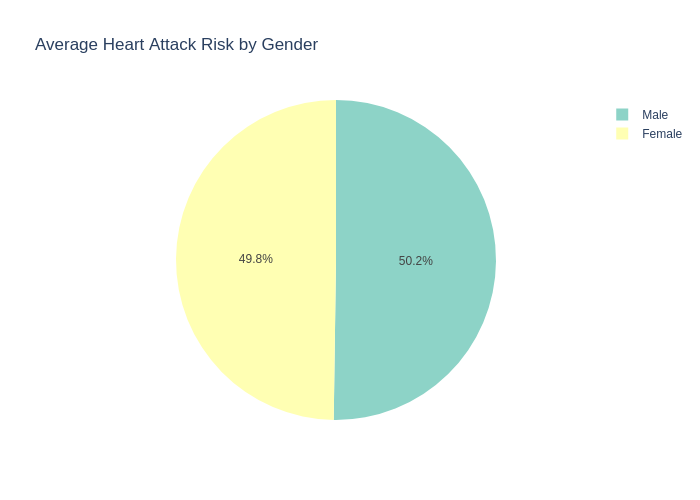
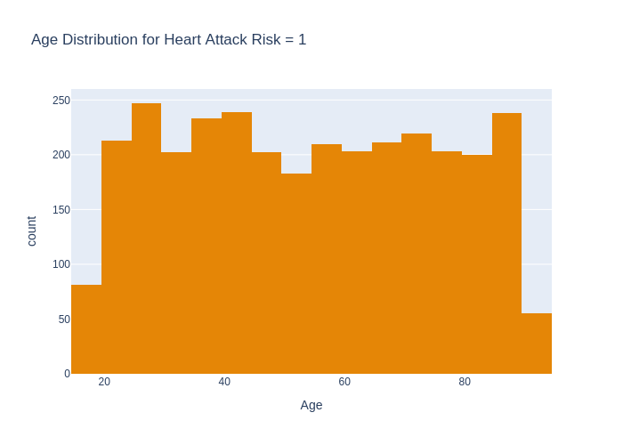
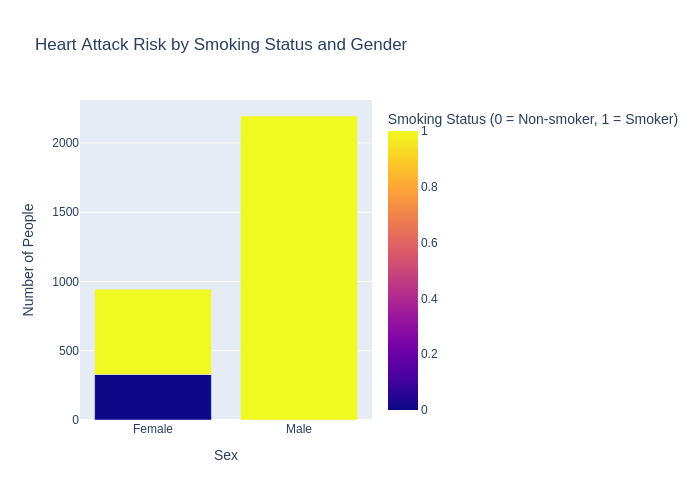

[](https://github.com/nogibjj/individual_project_huma/actions/workflows/install.yml)
[](https://github.com/nogibjj/individual_project_huma/actions/workflows/format.yml)
[](https://github.com/nogibjj/individual_project_huma/actions/workflows/lint.yml)
[](https://github.com/nogibjj/individual_project_huma/actions/workflows/test.yml)

# Individual Project 1
This is the fourth Assignment for Data Engineering.

# Youtube Video

In this video, I provide a comprehensive walkthrough of my Heart Attack Risk Analysis project. I explain the entire process—from data processing and exploratory data analysis to generating visualizations and setting up the CI/CD pipeline using GitHub Actions.
https://youtu.be/VGDl91hA8lU

# CI/CD Pipeline


# Heart Attack Risk Analysis 
## Project Aim
The aim of this project is to analyze the risk of heart attacks across different demographics and various lifestyle and health factors using data visualization techniques and statistical analysis. This analysis seeks to uncover patterns and trends that can help in predicting heart attack risks.

## Project Structure
The project directory is organized as follows:

```
DE_ASSIGN2_HUMA/
│
├── data/                        # Data files
│   └── heart_attack_prediction_dataset.csv
│
├── output/                      # Output files and reports
│   ├── plots/                   # Generated plots
│   │   ├── hemisphere_heart_attack_risk.png
│   │   ├── continent_heart_attack_risk.png
│   │   ├── country_heart_attack_risk.png
│   │   ├── smoking_gender_heart_attack_risk.png
│   │   ├── gender_heart_attack_risk_pie.png
│   │   ├── gender_heart_attack_risk_sunburst.png
│   │   ├── cholesterol_heart_attack_risk_violin.png
│   │   ├── age_distribution_heart_attack_risk.png
│   │   ├── systolic_bp_heart_attack_risk.png
│   │   └── diastolic_bp_heart_attack_risk.png
│   │
│   ├── Report.html              # Sweetviz HTML report
│   ├── summary_table.csv        # CSV file for summary statistics
|   └── heart_attack_report.pdf  # final pdf report containing all graphs and insights
│
├── EDA_first.py                 # Script for initial exploratory data analysis
├── main.py                      # Main script to run analyses
├── summary_pdf.py               # Script to generate PDF report
├── requirements.txt             # Project dependencies
└── README.md                    # Project documentation
```

## Setup and Installation

Clone the repository:

```
git clone https://github.com/yourusername/DE_ASSIGN2_HUMA.git
cd DE_ASSIGN2_HUMA
```

Install dependencies:

`make install` or `pip install -r requirements.txt`

## Functions Description
- generate_and_save_plots(df, save_dir): Generates and saves various plots to visualize the heart attack risk data.
- create_summary_table(df): Creates a table of summary statistics for the given DataFrame.
- create_pdf_report(df, image_dir, output_pdf): Generates a comprehensive PDF report with all the plots and summaries.

## Data
This dataset provides an array of risk factors associated with heart attacks.

Columns Overview:

- Patient ID: Unique identifier for each patient. (Categorical)
- Age: Patient's age in years. (Numeric)
- Sex: Patient's gender. (Categorical)
- Cholesterol: Measured cholesterol levels. (Numeric)
- Blood Pressure: Recorded blood pressure levels. (Numeric)
- Heart Rate: Measured heart rate. (Numeric)
- Diabetes: Indicates whether the patient has diabetes (Yes/No). (Categorical)
- Family History: Indicates a family history of heart disease (Yes/No). (Categorical)
- Smoking: Smoking status of the patient. (Categorical)
- Obesity: Indicates obesity status. (Categorical)
- Alcohol Consumption: Alcohol consumption patterns. (Categorical)
- Exercise Hours Per Week: Number of hours the patient exercises per week. (Numeric)
- Diet: Type of diet the patient follows. (Categorical)
- Previous Heart Problems: Indicates previous heart-related issues (Yes/No). (Categorical)
- Medication Use: Usage of prescribed medication (Yes/No). (Categorical)
- Stress Level: Assessed level of stress. (Numeric)
- Sedentary Hours Per Day: Average number of sedentary hours per day. (Numeric)
- Income: Annual income bracket. (Categorical)
- BMI: Body Mass Index. (Numeric)
- Triglycerides: Level of triglycerides in the blood. (Numeric)
- Physical Activity Days Per Week: Days per week the patient engages in physical activity. (Numeric)
- Sleep Hours Per Day: Average number of hours the patient sleeps per day. (Numeric)
- Country: The patient's country of residence. (Categorical)
- Continent: The continent on which the patient lives. (Categorical)
- Hemisphere: Hemisphere of the patient's location. (Categorical)
- Heart Attack Risk: Indicates if the patient is at risk of a heart attack (0 = No, 1 = Yes). (Categorical)
- Systolic_BP: Systolic blood pressure reading. (Numeric)
- Diastolic_BP: Diastolic blood pressure reading. (Numeric)

## Top Insights:
After thorough analysis, key insights include:

- Cholesterol, Blood Pressure, and BMI: Higher levels of cholesterol, systolic and diastolic blood pressure, and BMI are associated with increased heart attack risk, particularly noticeable in females.
- Age Distribution: Heart attack risk is not confined to older age groups; there are notable risks in individuals under 30 and over 60, indicating potential genetic and lifestyle influences.
- Income and Gender: While income variations do not significantly impact heart attack risk in males, higher income in females correlates with slightly increased risk, hinting at underlying socioeconomic factors.
- Lifestyle Factors: Minor variances in physical activity, sedentary behavior, and sleep hours suggest these factors alone are not major determinants of heart attack risk, highlighting the complexity of risk factors involved.
- Recommendations: Efforts to prevent heart attacks should prioritize the management of modifiable risk factors such as cholesterol and blood pressure, tailored to individuals across all age groups and genders, emphasizing universal cardiovascular health strategies.

## Output Files Description:

**Report.html**: An interactive HTML report generated by Sweetviz, providing an extensive exploratory data analysis overview.

You can view the .html file in your browser and explore more insights about each column of the data.
[](https://www.loom.com/share/e6987d516de24be585584a4c0b8f91bd)

**heart_attack_report.pdf**: The report provides detaied insights dervied after this analysis. ALl the plots and visualistions are provided in the report with explanaation. This is generated in the main.py file after all the plots are generated, all the insights are compiled into one .pdf report. 

[](pdf_report_gif.mp4)


**summary_table.csv**: A CSV file containing summary statistics of the data analyzed.


**Plots**: Various plots in the plots/ directory visual
ize specific aspects of the data, helping visualize trends and distributions that inform the analysis.


### How to View Output

- HTML Report: Open output/Report.html in a web browser to view the interactive exploratory analysis report.
- Summary Table: View output/summary_table.csv using any CSV reader or within a Python environment using pandas.
- PDF Report: The comprehensive analysis including plots and insights is compiled into output/heart_attack_report.pdf, which can be opened with any PDF reader.

### Example Plots and Images

These are some of the plots drawn as part of the analysis. The pdf report and the html file contains more plots and a deep dive into the dataset. 










### Conclusion

This project highlights the importance of data-driven insights in understanding and predicting health risks. 

